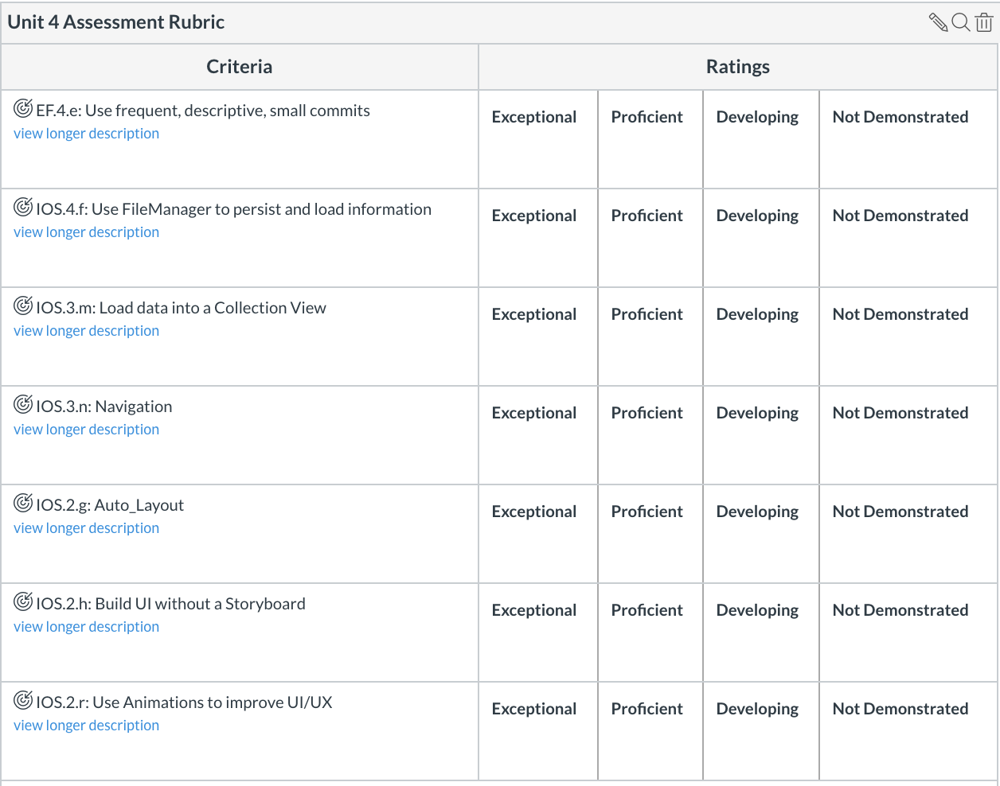

# Unit 4 Assessment - Flash Cards


## Github Instructions
- Clone this repository to your machine.
- Create a new branch for your work. Example: `davids-branch`
- Complete the sections below.
- Commit code as needed. Reminder: your commit history is part of what is being assessed.
- Push your branch to Github.
- Create a pull request to the master branch on Github. Tag the Instruction Associates and Instructor in your pull request.
- Paste the link of your pull request into Canvas.

## App Description
Build a Flash Cards app that allows the user to create flash cards. Any created or saved flash cards should be persisted to the documents directory. The user should then be able to use those flash cards to test their knowledge!

## App Architecture

The app has three (3) tabs attached to a Tab Bar Controller:

- **1: Cards** - a collection view of all YOUR flash cards.
- **2: Create** - the user can create a flash card here. It should consist of a UITextField and two UITextViews.
- **3: Search Online** - a collection view that loads the results of a call to the API below. You can add flash cards to YOUR list using the results of this API call.

There are also some interesting stretch features (below the rubric).

### AutoLayout Requirements

Your UI should be created programmatically using constraints. Do not use a storyboard. The Tab Bar Controller has been created in the Scene Delegate as the root view controller, but only has empty UIViewControllers.

### Flash cards collection
The first view controller contains the user's flash card collection. When the view loads, each "card" should show the title of the card. When a user taps the card, it should use an animation to load the "back" of the card, which lists the description (facts) of the card.

The user should be able to delete a flash card from their collection, and should NOT be able to add a card that is a duplicate of one that already exists.

**Sample UI:**


### Creating a flash card
The second view controller allows the user to create a flash card. 

Make sure to handle all required fields appropriately with alerts to the user. e.g "Title is required," or "The Quiz requires two facts." **All fields are required**


### Steps for creating a flash card in the Create Card View Controller

1. Enter the title of the card. e.g "Quick Sort."
2. Enter a first term (description) for the card. e.g "Uses divide and conquer and splits the array into three parts based on a "pivot" variable."
3. Enter a second term (description) for the card e.g "Picks an element as pivot and partitions the given array around the picked pivot."
4. After all required fields are filled in, the user then taps on the "Create" button.
5. The card should now be visible in the Flash Cards tab.

**Sample UI (the VC can be embedded in the tab bar and does not need to present modally):**


### Adding a Flash Card from the Search tab
The third view controller loads flash cards from the endpoint below. The user can look through the list of flash cards and add one to their persisted collection using an action sheet. The user should be able to click on a flash card in this collection and view the description using a transition animation.

**Sample UI:**


## Endpoint for Search Tab

```
GET https://5daf8b36f2946f001481d81c.mockapi.io/api/v2/cards
```

## Requirements - Rubric




## Stretch

- Allow a user to search through their flash cards using a Search Bar.
- Allow a user to add an image to their flash card, which will show when the card's description is visible (hint: think about how this will affect the card model).
- Allow a user to add more than two facts to a flash card in the create screen (hint: you might need keyboard handling to make space).
- Allow users to log in and log out. Persist a username using User Defaults, and persist that particular user's cards. The Cards View Controller should show "\(username)s flash cards" as the title in the navigation bar. When a user is logged out, they should not be able to create or add new cards. When a **new** user logs in, they should not have any persisted cards (hint: each user's cards should be saved to a different plist file).

One day: add gifs

